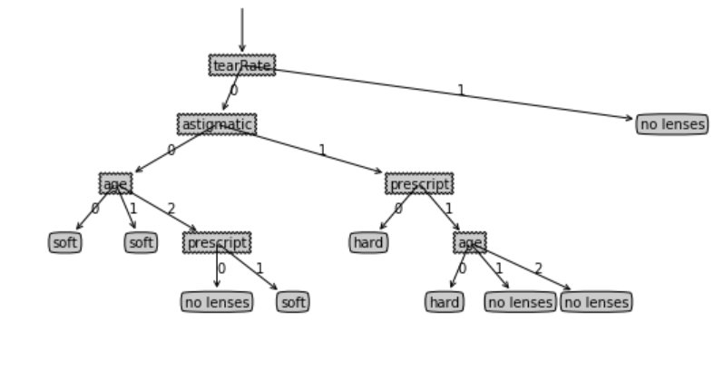

# 实验报告

## 算法原理

- 本次实验采用 ID3 算法
- 每次循环都计算所有特征的信息增益，然后选择信息增益最大的那个特征
  - 香农熵：$Shannon(p)=\sum_{i}-p_ilog_2p_i$
  - 信息增益：$Gain(S,F)=Shannon(S)-\sum_{f\in values(F)}\frac{|S_f|}{S}Shannon(S_f)$
- 然后根据这个特征的每个可能取值划分数据集，继续递归构造此特征的子树
  - 根据 $F_k$ 的取值 $f$ 划分数据集：对数据集中每个数据 $d$，只保留 $d[F_k]=f$ 的数据，且删去 $F_k$ 这个特征

- 伪代码

```
if 所有样本分类相同:
	返回该分类
if 特征全部使用完:
	返回数量最多的分类
计算每一个特征 Fi 对应的信息增益 Gi, 找到数值最大的 Gk
for f in 可能取值(Fk):
	树[Fk][f] = 构建树(划分数据集(Fk, f))
```

## 决策树核心代码

### 数据预处理

经过预处理后，"young, myope, no, reduced, no lenses" 转化为 [0, 0, 0, 0, "no lenses"]

```python
# 特征标签
FEAT_LABEL = ['age', 'prescript', 'astigmatic', 'tearRate']
# 特征可选值
FEAT_DICT = {
    'age': ['young', 'pre', 'presbyopic'],
    'prescript': ['myope', 'hyper'],
    'astigmatic': ['no', 'yes'],
    'tearRate': ['normal', 'reduced']
}
# 分类标签
RES_LABEL = ['hard', 'soft', 'no lenses']

def index_of(arr, val):
    for i in range(len(arr)):
        if arr[i] == val:
            return i
    return -1

# 将文本数组转化为特征向量
def arr_to_vector(arr):
    res = arr
    for i in range(len(arr) - 1):
        res[i] = index_of(FEAT_DICT[FEAT_LABEL[i]], arr[i])
    return res

# 数据预处理
def pre_process(path):
    res = []
    with open(path, 'r') as f:
        line = f.readline()
        while line:
            arr = line[:-1].split('\t')
            res.append(arr_to_vector(arr))
            line = f.readline()
    return res
```

### 划分数据集和选择最佳划分特征

```python
from math import log
# 香农熵
def shannon(data_set):
    category_dict = {}
    for vec in data_set:
        category = vec[-1]
        if category in category_dict:
            category_dict[category] += 1
        else:
            category_dict[category] = 1
    res = 0.0
    for category in category_dict:
        p = float(category_dict[category]) / len(data_set)
        res -= p * log(p, 2)
    return res

# 划分数据集
def get_divided_set(data_set, feat_idx, feat_val):
    res = []
    for vec in data_set:
        if vec[feat_idx] == feat_val:
            new_vec = vec[:feat_idx]
            new_vec.extend(vec[feat_idx+1:])
            res.append(new_vec)
    return res

# 寻找最优划分方式
def find_best_feat(data_set):
    shannon_raw = shannon(data_set)
    max_info_gain = 0.0
    best_feat_idx = 0
    for i in range(len(data_set[0])-1):
        feat_vals = set([d[i] for d in data_set])
        shannon_divided = 0.0
        for j in range(len(feat_vals)):
            divided_set = get_divided_set(data_set, i, j)
            p = float(len(divided_set)) / len(data_set)
            shannon_divided += p * shannon(divided_set)
        info_gain = shannon_raw - shannon_divided
        if info_gain > max_info_gain:
            max_info_gain = info_gain
            best_feat_idx = i
    return best_feat_idx
```

### 递归构建决策树

```python
# 构建决策树
def create_dicision_tree(data_set, labels):
    # 所有分类标签全部相同, 完成分类
    categories = [d[-1] for d in data_set]
    if categories.count(categories[0]) == len(categories):
        return categories[0]
    # 如果所有特征都使用过了依然不能唯一确定, 返回最多的分类
    if len(data_set[0]) == 1:
        cat_dict = {}
        for cat in categories:
            if cat in cat_dict:
                cat_dict[cat] += 1
            else:
                cat_dict[cat] = 1
        max_cat = ''
        max_cat_num = 0
        for cat in cat_dict:
            if cat_dict[cat] > max_cat_num:
                max_cat = cat
                max_cat_num = cat_dict[cat]
        return max_cat
    # 构建树
    best_feat = find_best_feat(data_set)
    best_feat_label = labels[best_feat]
    del labels[best_feat]
    # 初始化当前最佳划分特征对应的子树
    tree = { best_feat_label: {} }
    feat_vals = set([d[best_feat] for d in data_set])
    for val in feat_vals:
        # 注意要复制!传递的是引用!
        labels_copy = labels[:]
        # 构建当前最佳划分特征每个值的子决策树
        tree[best_feat_label][val] = create_dicision_tree(get_divided_set(data_set, best_feat, val), labels_copy)
    return tree
```

### 从文件中构建决策树

```python
# 数据文件放在代码同级的目录下
file_path = 'lenses.txt'
data_set = pre_process(file_path)
tree = create_dicision_tree(data_set, FEAT_LABEL)
print(tree)  # 树的结果见下一部分——实验结果
```

> 因为是决策树部分核心代码，将树绘制成图的代码在这里不做展示

##  实验结果

得到的树

```
{'tearRate': {0: {'astigmatic': {0: {'age': {0: 'soft', 1: 'soft', 2: {'prescript': {0: 'no lenses', 1: 'soft'}}}}, 1: {'prescript': {0: 'hard', 1: {'age': {0: 'hard', 1: 'no lenses', 2: 'no lenses'}}}}}}, 1: 'no lenses'}}
```

绘制的树图形

